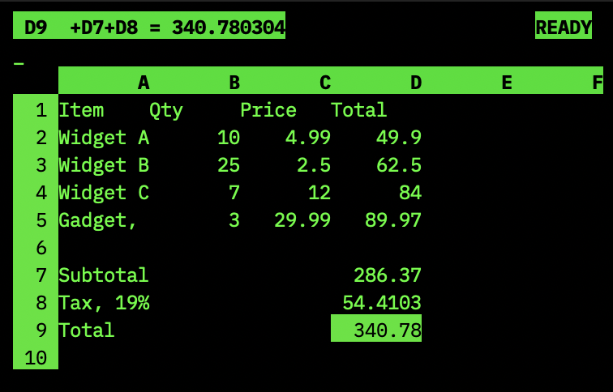

# kalk

A minimal spreadsheet for the terminal. Single C file, no dependencies
beyond ncurses.

	$ kalk budget.csv

Inspired by VisiCalc and mostly compatible with it. Reads and writes CSV.
Supports formulas with cell references, basic functions, cell formatting,
row/column operations, and frozen titles.

## Build

	make
	make install        # installs to /usr/local
	make install PREFIX=/usr

Requires a C99 compiler and ncurses.

## Usage

Arrow keys navigate. Type a number or formula to enter data. Formulas
start with `+`, `-`, `(`, or `@`. Anything else is a label.

Press `/` for commands:

	/B          Blank cell
	/C          Clear sheet
	/DR /DC     Delete row/column
	/IR /IC     Insert row/column
	/F_         Format cell (L R I G D $ % *)
	/GC         Set column width
	/GF_        Set global format
	/M          Move row/column (arrow keys to drag)
	/R          Replicate (copy with relative refs)
	/SL /SS     Load/Save CSV
	/SQ         Save and quit
	/TV/TH/TB/TN  Lock title rows/columns
	/Q          Quit

Other keys:

	>           Go to cell (type reference)
	!           Force recalculation
	"           Enter label
	Backspace   Clear cell
	Tab         Next column
	Enter       Next row
	Home        Jump to A1
	Ctrl-C      Quit

## Formulas

Arithmetic: `+A1*B2-3`, `(A1+A2)/2`

Functions: `@SUM(A1...A10)`, `@ABS(x)`, `@INT(x)`, `@SQRT(x)`

Cell references adjust automatically on replicate, insert, and delete.
Use `$` for absolute references: `$A$1` (fixed), `$A1` (fixed column),
`A$1` (fixed row).

## License

MIT
